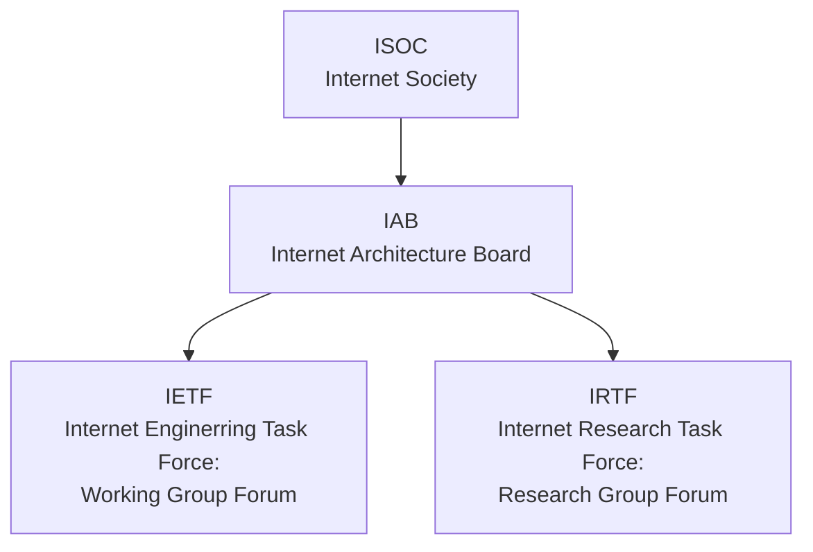
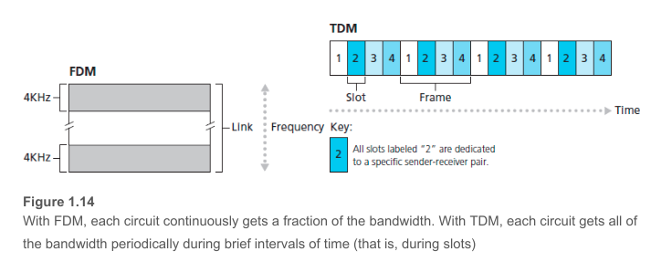

计算机网络

[TOC]

# 1.概述

* 网络特点: 联通性和共享

* | 互联网(the Internet)                   | 互连网(internet) |
  | -------------------------------------- | ---------------- |
  | 专有名词                               | 通用名词         |
  | 全球最大\开放\众多网络互联而成的因特网 | 多个网络互连而成 |
  | TCP/IP协议族                           | 通信规则任意     |

### 1.2.2发展阶段

* $单个网络ARPANET向互连网发展 \rightarrow  三级结构互联网\rightarrow 多层次ISP结构$

* ISP(Internet Service Provider): 主干(10Gb/s), 地区, 本地

* IXP(Internet eXchange Point): 优化且直接让地区ISP交流

  > 允许两个网络直接相连交换分组,无需第三个网络转发

### 1.2.3 体系

## 1.3互联网组成

***

### 1.3.1 边缘部分(主机$_{信息处理}$+用户)

* 端系统(end system)
* C/S$\rightarrow$Clinet-Server$\rightarrow$客户-服务器(两个进程)
* 客户程序
  * 主动请求服务,须知服务器address
  * 无需special hardware & complex OS
* 服务程序
  * 同时批处理多请求
  * 无需知客户及address
  * 强大硬件和高级复杂的OS
* P2P(Peer-to-peer)$\rightarrow$对等连接方式     非绝对的C/S地位
* B/S(Browser/server)

### 1.3.2核心部分

* 电路交换(circuit Switching)
>* 频分复用 (Frequency-Division Multiplxing; FDM)和 时分复用(Time-Division Multiplexing; TDM)
>  * FDM: 一段频段的宽度称为**带宽(bandwidth)**, 链路的频谱由跨越链路创建的所有链接共享(the frequency spectrum of a link is divided up among the connections established across the link.)
>  * TDM:  time is divided into frames of fixed duration, and each frame is divided into a fixed number of time slots. 时(间间 )隙<==>slots
>>
>>eg. TDM: if the link transmits 8,000 frames persecond and each slot consists of 8 bits, then the transmission rate of each circuit is 64 kbps.
>>eg. FDM: the frequency domain is segmented into four bands, each of bandwidth 4 kHz. For TDM, the time domain is segmented into frames, with four time slots in each frame; each circuit is assigned the same 
dedicated slot in the revolving TDM frames.
> 电路交换在静默期(silent period)$_{没有实时请求数据输入输出的时间段}$会占用资源造成浪费

* 分组交换(Packet Switching) by 存储转发(store-and-forward)传输$_{存完一个分组才能发}$

>* 导引1: 报文(Message)$\rightarrow$分组且加上各组的首部(控制信息)$\rightarrow$当前分组发给路由器(router)$\rightarrow$router缓存进行存储,存储完当前分组$\rightarrow$转发出去$\rightarrow$...$\rightarrow$目的地根据各个分组的首部信息重组得到报文
>* 导引2: 设有一分组为$L$ bit, 传输速率是$R$ bit/s, 假设传输模型是$\textcolor{orange}{Source\rightarrow Router\rightarrow Destination}$ , 从S$\rightarrow$R的时间$t=\frac{L}{R}$,所以当前分组总传输时长(S-R-D)为$2t=\frac{2L}{R}$
>* N条速率均为R的链路组成的路径, (N-1)台router, 从源到目的地发送**一个**分组, 由导引得传输时间(时延)
>
>$$
>d_{端到端}=N\frac{L}{R}
>$$
>若有**P个**分组, 由于router可以同时store与forward那么传输时间是
>$$
>d_{端到端}=(P-1)N\frac{L}{R}
>$$
>
>* 排队时延和分组丢失
> * 分组交换机有多条链路相连, 每条链路有一个**输出缓存/队列(output buffer/queue)**, 存储准备forward的分组. 当需要发送的时候, 当前链路仍然被占用,就需要承受**排队时延(queuing delay)**. 由于分组缓存有限, 会出现**分组丢失(丢包)(packet loss)**
>* 转发表和路由选择协议
>   * 转发表(Forwarding table): 将目的地址的子集映射成 _输出链路_, 路由器收到分组后用目的地址在转发表内进行检索, 根据算法选择出链路.
>    * 路由选择协议(routing protocol) see chap5 and [Traceroute](www.traceroute.org)

* 电路交换vs分组交换
	* Circuit switching pre-allocates use of the transmission link regardless of _demand_, with allocated but unneeded link time going unused.
	* Packet  switching on the other hand allocates link use on _demand_. Link transmission capacity will be shared on a packet-by-packet basis only among those users who have packets that need to be transmitted over the link.
***

## 1.4 分组交换网络(Packet-Switched Networks)中的时延(Delay)、丢包(Loss)、吞吐量(Throughput)——性能
### 1.4.1 时间延迟(Delay)
* Total nodal delay = nodal processing delay + queuing delay + transmission delay + propagation delay
	* Procesing delay: Examine the packet's header; determine where to direct, bit-level error checking
	* Queuing delay: packet waits to be transmitted onto the link.$\\_{depending~ on~ the~ number~ of~ earlier-arriving~ packets,~ and~ the~ size~ of~ queue}$ 
	* Transmission delay: 发包时间 $delay = \frac{Length~of~ the~ packets/bits}{Rate~ of~ the~ Ethernet~ link/Mbps}$ 
	> the amount of time in**A ROUTER** _pushing out $\rightarrow$_  *packets*, which is a $f(Length_of_packets,~Rate_of_transmission)unction.
	
	* Propagation delay: 包跑时间depends on the physical medium of the link (that is,  fiber optics, twisted-pair copper wire)
	> the amount of time in **ROUTER_A** $\rightarrow 1~bit\rightarrow$ **ROUTER_B**, also a $f(physical\_space\_distance\_A\_to\_B)unction$
	* $\textcolor{red}{Difference~ between~Transmission~ \&~Propagation }$

* 时延带宽积=传播时延 X 带宽，带宽在时间上的积分，若链路的占比越大利用率越大
* 往返时间RTT
* 利用率
	* 信道利用率$_{某信道有x\%时间是被利用的，完全空闲为0}$和网络利用率$_{全网络信道利用率加权平均}$
	* 利用率越大，引起的时延迅速增加
	* 设$D_0:网络空闲时延$，$D:网络当前时延$，$U:网络利用率U\in[0,1]$，假设条件下有：
$$D=\frac{D_0}{1-U}\leftrightarrow网路当前时延\times{当前未利用率}={网络空闲时延}
$$
* 协议体系结构

| OSI | TCP/IP |五层协议|
|--|--|--|
|7应用层|4应用层  | 5应用层 |
|6表示层|(协议DNS,HTTP,SMTP...)||
|5会话层|||
|4运输层||4运输层|
|3网络层|3运输层(TCP/UDP)|3网络层|
|2数据链路层|2网际层IP|2数据链路层|
|1物理层|1网络接口层(无具体内容)|1物理层|

